# 1. Random variables
Các khái niệm:  
Hàm là gì?   
Biến là gì?  

Ω (omega) là Không gian mẫu, tất cả các sự kiện có thể xảy ra   
∩ là giao nhau  
∪ là hoặc, hợp  

event là tập con của Ω chứa một hoặc nhiều khả năng
probability là "xác xuất", là khả năng xảy ra của một event
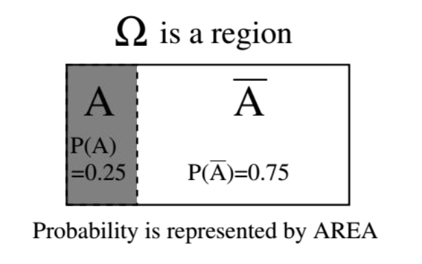

a random variable is a numeric summary of the outcome of a random experiment (Biến ngẫu nhiên = là mapping một event thành một con số)  
Biến ngẫu nhiên luôn được viết bằng chữ in hoa (X,Y,...)

VD: X là số lượng con trai trong một gia đình có 3 con → X có thể nhận giá trị 0, 1, 2 hoặc 3.
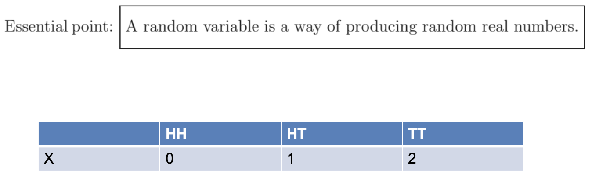

Giá trị cụ thể của biến ngẫu nhiên được viết bằng chữ thường (ví dụ: x, y,...) là một con số

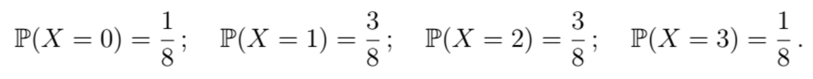
Dạng tổng quát: P(X = x), với x có thể là 0, 1, 2 hoặc 3.

Sự kiện (event) dùng dấu “∪” (or) và “∩” (and).
Xác suất (probability) của sự kiện dùng phép cộng (cho OR) hoặc nhân (cho AND nếu độc lập)

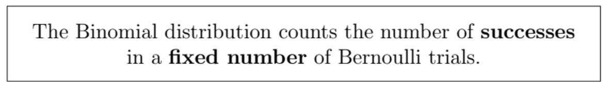
X ~ *Bin*(n, p)
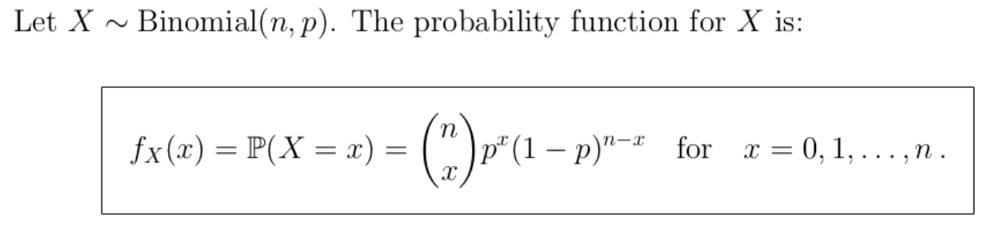

# 2. Conditional probability
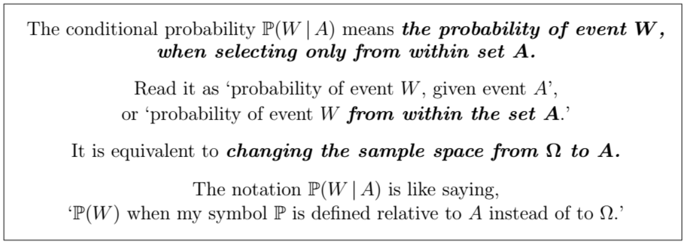
**The Multiplication Rule**:
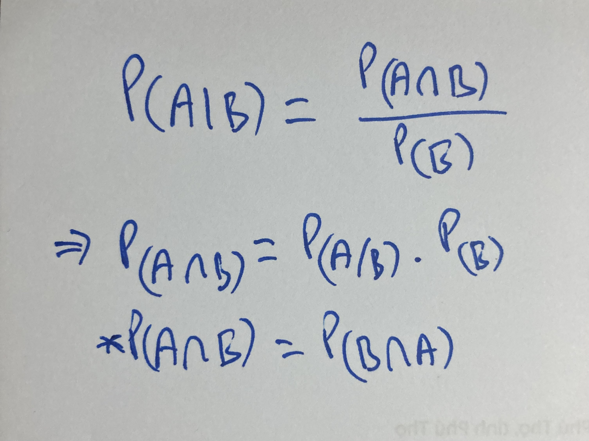
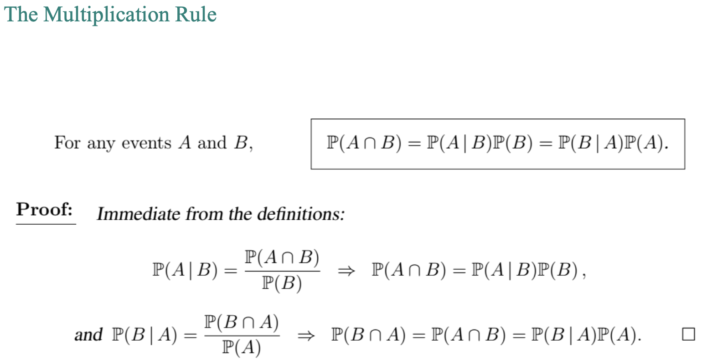
Công thức Xác xuất có điều kiện: Xác suất của A trên điều kiện B sẽ bằng xác suất của A giao B chia cho xác suất của B.

Đổi không gian mẫu: P(A∩B)/P(B)=P(B∩A)/P(A)
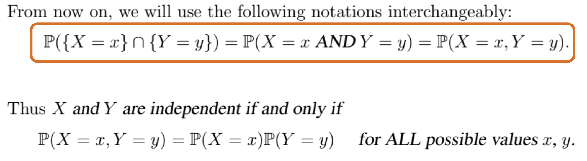
Dấu "," trong P(X=x, Y=y) nghĩa là "AND" hay "∩"
# 3. Bayes’ Theorem
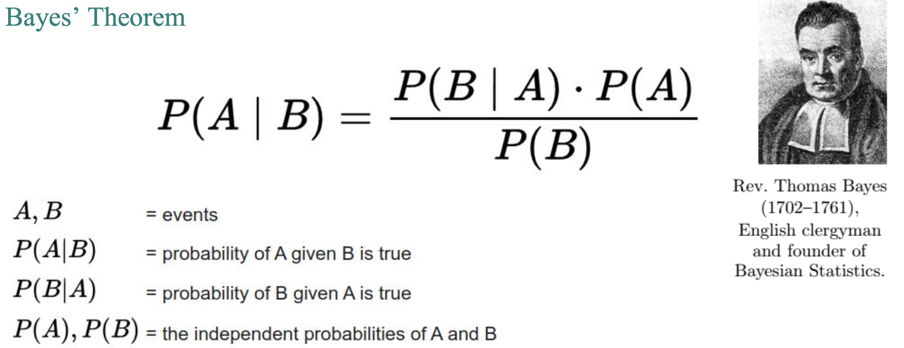
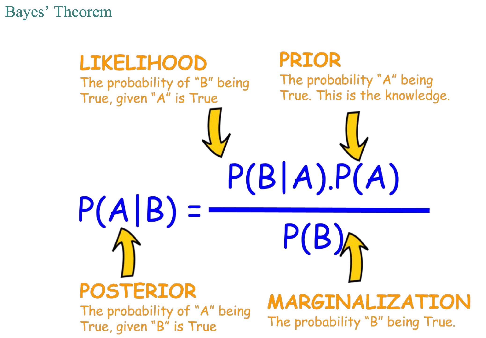
Likelihood:   
Prior:  
Maginalization: thường dùng Partition theorem để tính  
Posterior:

# 4. Partition theorem
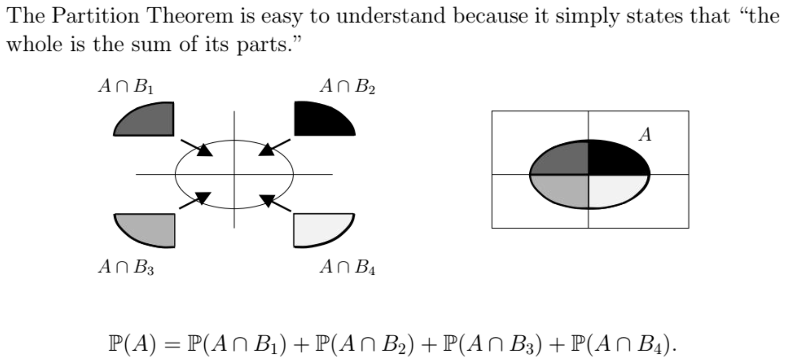
Áp dụng **Multiplication Rule**   
-> P(A) = P(A|B1)/P(B1) + P(A|B2)/P(B2) + P(A|B3)/P(B3) + P(A|B4)/P(B4)
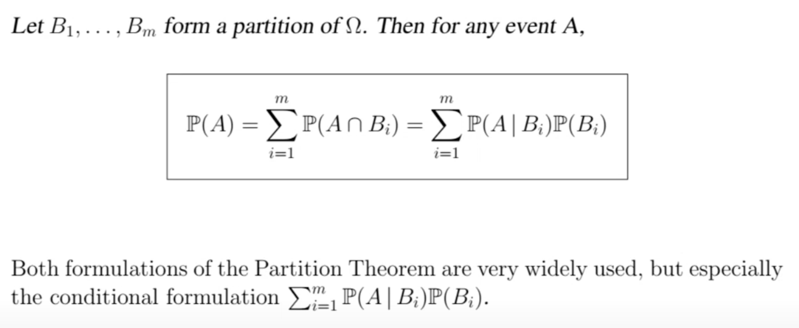

### Bayes’ Theorem homework
1. Consider a test to detect a disease that 0.1 % of the population have. The test is 99 % effective in detecting an infected person.
However, the test gives a false positive result in 0.5 % of cases. If a person tests positive for the disease what is the probability that they actually have it?
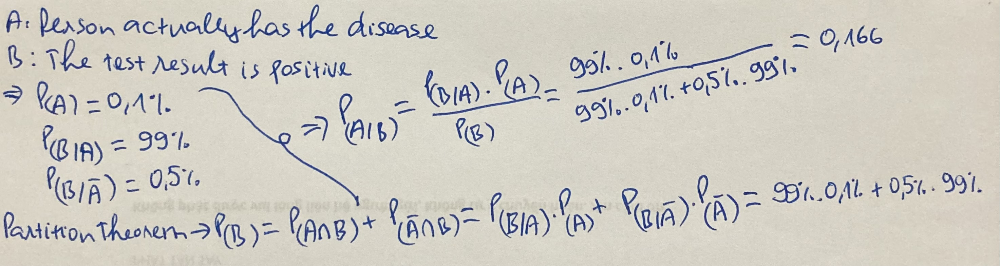

2. It is estimated that 50% of emails are spam emails. Some software has been applied to filter these spam emails before they reach your inbox. A certain brand of software claims that it can detect 99% of spam emails, and the probability for a false positive (a non-spam email detected as spam) is 5%.
Now if an email is detected as spam, then what is the probability that it is in fact a non-spam email?

3. Early HIV Testing and Bayes’ Theorem
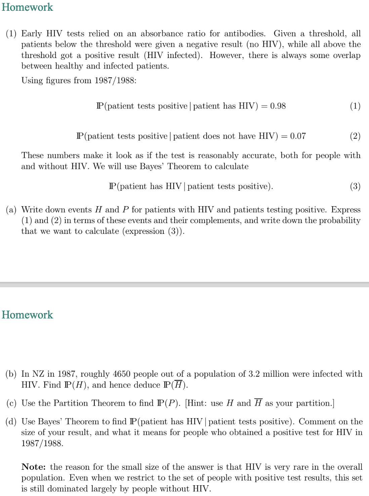
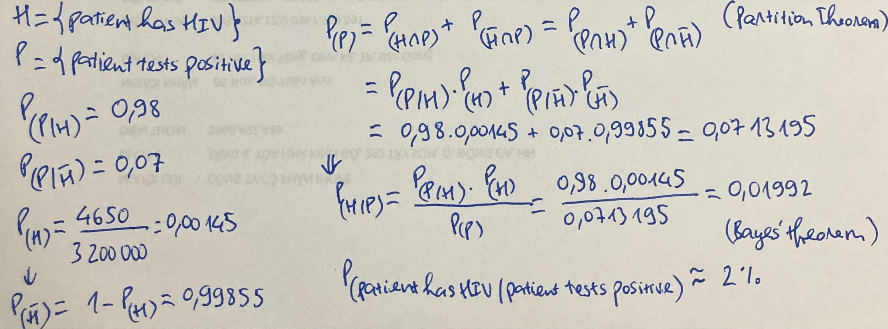
## Keep in mind!!!
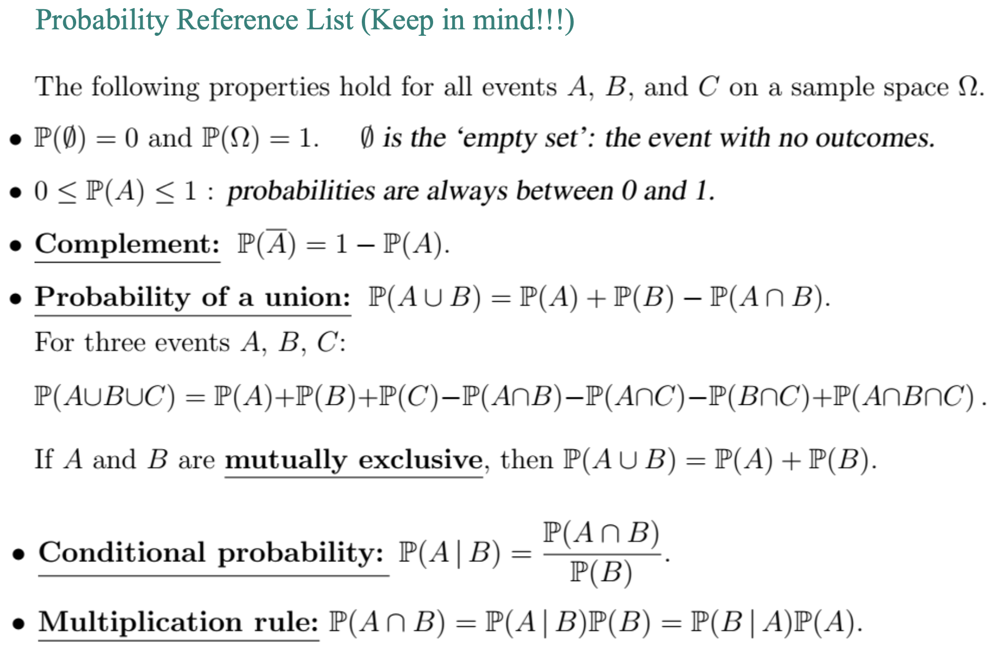
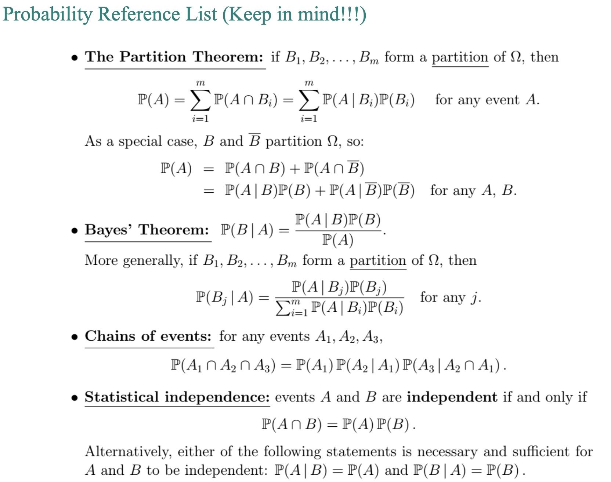

# 5. Expectation and variance of a random variable
**Expectation** is the *average* (*a fixed constant* with any size) of the **Ω**.  
**Average** is the mean of an **event** (*a random variable*).  
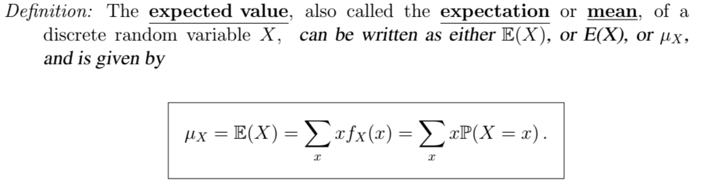
μ(X) = ∑x.fX(x) (probability function; FX(x): Cumulative Function)

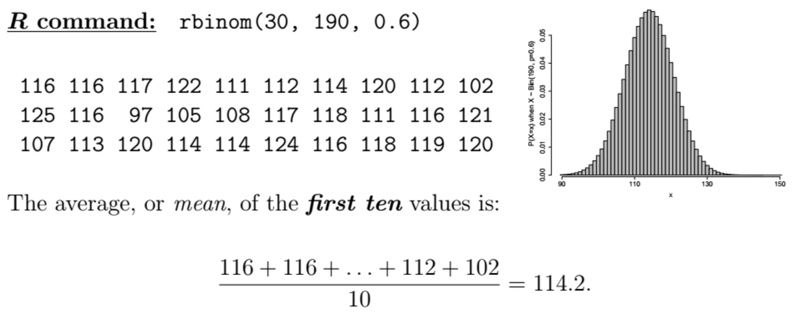
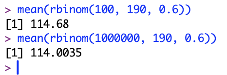

E(X) = n*p
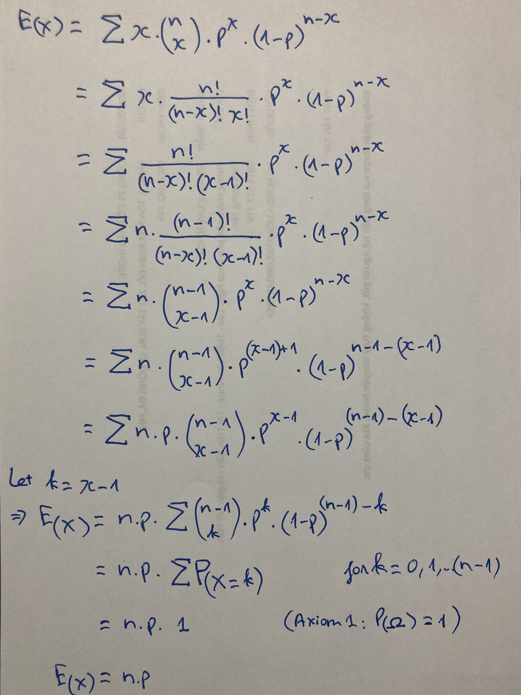